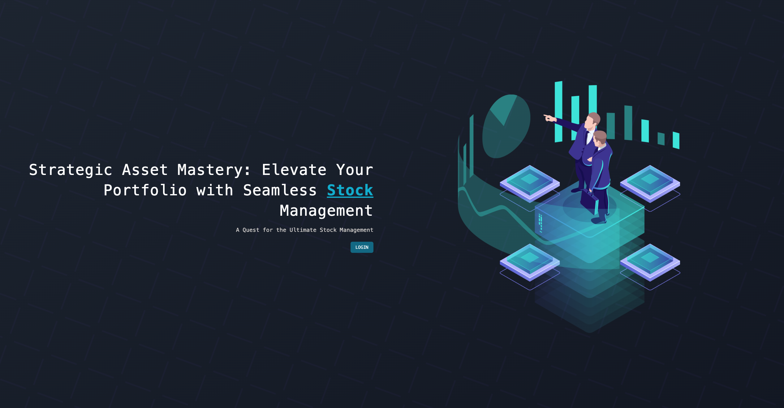
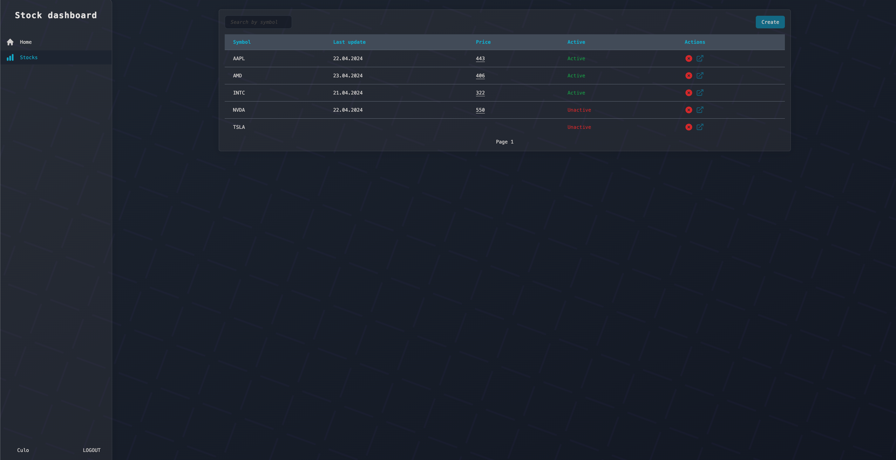

Admin dashboard application for stock asset management written in React

### What can you see here?

- nx dev
- Keycloak for authentication
- Redux and RTK query for state management and API calls
- Tailwind for style

### Is there any image of app?





### How to set app authentication with Keycloak?

- visit keycloak admin dashboard (http://localhost:8080). Should be up and running after docker-compose up -d
- select option 'Clients' from main menu and click "Create client" button
- set Client ID to Stock.Client
- set valid redirect URI
- go to advanced tab
- set "Proof Key for Code Exchange Code Challenge Method" to S256
- download adapter config and put it in environment.ts

```json
{
  "realm": "PortfolioRealm",
  "auth-server-url": "http://localhost:8080/",
  "ssl-required": "external",
  "resource": "Stock.Client",
  "public-client": true,
  "confidential-port": 0
}
```

### How to generate RTK query files

- go to stores/api directory (make sure that all API endpoints are runing to generate files)

Stock API slice

```
npx @rtk-query/codegen-openapi stopOpenApiConfig.ts
```

Crypto API slice

```
npx @rtk-query/codegen-openapi cryptoOpenApiConfig.ts
```

### How to run it?

```
nx serve stock-dashboard
```
