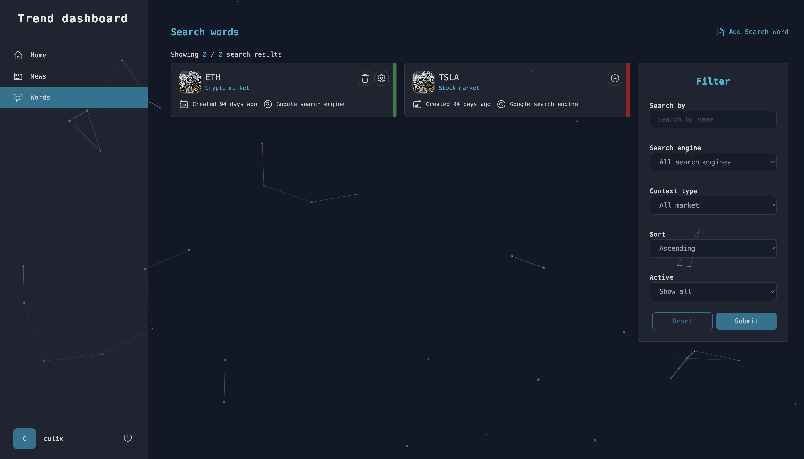

Admin dashboard application for trend management written in Angular

### What can you see here?

- nx dev
- Keycloak for authentication
- NgRx signals
- Tailwind for style

### Is there any image of app?





### How to generate trend API client ?

```
openapi-generator generate -i swagger.json -g typescript-angular -o /Users/bozoculo/git_repos/Portfolio/src/Web/admin-dashboard/apps/trend-dashboard/src/app/shared/services/open-api --additional-properties fileNaming=kebab-case --skip-validate-spec --type-mappings=DateTime=Date
```

### How to set app authentication with Keycloak?

- visit keycloak admin dashboard (http://localhost:8080). Should be up and running after docker-compose up -d
- select option 'Clients' from main menu and click "Create client" button
- set Client ID to Trend.Client
- set valid redirect URI http://localhost:4200/_ and Web origin _
- go to advanced tab
- set "Proof Key for Code Exchange Code Challenge Method" to S256
- download adapter config and put it in environment.ts

```json
{
  "realm": "PortfolioRealm",
  "auth-server-url": "http://localhost:8080/",
  "ssl-required": "external",
  "resource": "Trend.Client",
  "public-client": true,
  "confidential-port": 0
}
```

### How to run it?

```
pnpm install && nx serve trend-dashboard
```
